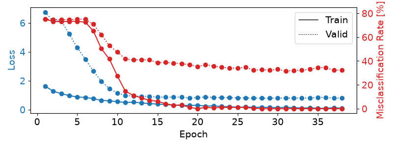
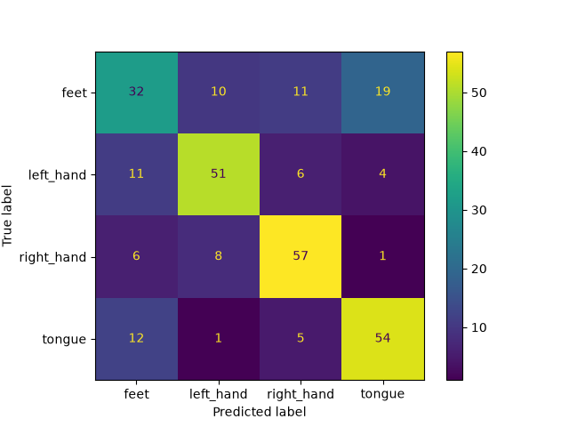

Braindecode package version: 1.8.1

Documentation scope: https://braindecode.org/dev/

Source commit: [63b0d026a62e4094f706170f04e27b663876a2ee](https://github.com/braindecode/braindecode/tree/63b0d026a62e4094f706170f04e27b663876a2ee)

Canonical HTML: [Motor imagery tutorial](https://braindecode.org/dev/auto_examples/model_building/plot_bcic_iv_2a_moabb_trial.html)

---

<!-- DO NOT EDIT. -->
<!-- THIS FILE WAS AUTOMATICALLY GENERATED BY SPHINX-GALLERY. -->
<!-- TO MAKE CHANGES, EDIT THE SOURCE PYTHON FILE: -->
<!-- "auto_examples/model_building/plot_bcic_iv_2a_moabb_trial.py" -->
<!-- LINE NUMBERS ARE GIVEN BELOW. -->

<a id="sphx-glr-auto-examples-model-building-plot-bcic-iv-2a-moabb-trial-py"></a>

<a id="bcic-iv-2a-moabb-trial"></a>

<a id="basic-brain-decoding-on-eeg-data"></a>

# Basic Brain Decoding on EEG Data

This tutorial shows you how to train and test deep learning models with
Braindecode in a classical EEG setting: you have trials of data with
labels (e.g., Right Hand, Left Hand, etc.).

> ##### This example covers:
> 
> * [Loading and preparing the data](#loading-and-preparing-the-data)
>   * [Loading the dataset](#loading-the-dataset)
>   * [Preprocessing](#preprocessing)
>   * [Extracting Compute Windows](#extracting-compute-windows)
>   * [Splitting the dataset into training and validation sets](#splitting-the-dataset-into-training-and-validation-sets)
> * [Creating a model](#creating-a-model)
> * [Model Training](#model-training)
> * [Training for longer](#training-for-longer)
>   * [Plot training curves](#plot-training-curves)
> * [Plotting a  Confusion Matrix](#plotting-a-confusion-matrix)
> * [References](#references)
<!-- GENERATED FROM PYTHON SOURCE LINES 17-20 -->

<a id="loading-and-preparing-the-data"></a>

## Loading and preparing the data

<!-- GENERATED FROM PYTHON SOURCE LINES 23-26 -->

<a id="loading-the-dataset"></a>

### Loading the dataset

<!-- GENERATED FROM PYTHON SOURCE LINES 29-38 -->

First, we load the data. In this tutorial, we load the BCI Competition
IV 2a data <sup>[1](#id5)</sup> using braindecode’s wrapper to load via
[MOABB library](https://moabb.neurotechx.com) <sup>[2](#id6)</sup>.

#### NOTE
To load your own datasets either via mne or from
preprocessed X/y numpy arrays, see [MNE Dataset Example](../datasets_io/plot_mne_dataset_example.html#mne-dataset-example)
and [Custom Dataset Example](../datasets_io/plot_custom_dataset_example.html#custom-dataset-example).

<!-- GENERATED FROM PYTHON SOURCE LINES 38-45 -->
```Python
from braindecode.datasets import MOABBDataset

subject_id = 3
dataset = MOABBDataset(dataset_name="BNCI2014_001", subject_ids=[subject_id])
```

```none
/opt/hostedtoolcache/Python/3.12.14/x64/lib/python3.12/site-packages/moabb/datasets/bnci/base.py:456: FutureWarning: Montage name 'standard_1005' is deprecated and will be removed in MNE 1.14. Use 'colin27_1005' instead.
  montage = make_standard_montage("standard_1005")
/opt/hostedtoolcache/Python/3.12.14/x64/lib/python3.12/site-packages/moabb/datasets/bnci/base.py:456: FutureWarning: Montage name 'standard_1005' is deprecated and will be removed in MNE 1.14. Use 'colin27_1005' instead.
  montage = make_standard_montage("standard_1005")
/opt/hostedtoolcache/Python/3.12.14/x64/lib/python3.12/site-packages/moabb/datasets/bnci/base.py:456: FutureWarning: Montage name 'standard_1005' is deprecated and will be removed in MNE 1.14. Use 'colin27_1005' instead.
  montage = make_standard_montage("standard_1005")
/opt/hostedtoolcache/Python/3.12.14/x64/lib/python3.12/site-packages/moabb/datasets/bnci/base.py:456: FutureWarning: Montage name 'standard_1005' is deprecated and will be removed in MNE 1.14. Use 'colin27_1005' instead.
  montage = make_standard_montage("standard_1005")
/opt/hostedtoolcache/Python/3.12.14/x64/lib/python3.12/site-packages/moabb/datasets/bnci/base.py:456: FutureWarning: Montage name 'standard_1005' is deprecated and will be removed in MNE 1.14. Use 'colin27_1005' instead.
  montage = make_standard_montage("standard_1005")
/opt/hostedtoolcache/Python/3.12.14/x64/lib/python3.12/site-packages/moabb/datasets/bnci/base.py:456: FutureWarning: Montage name 'standard_1005' is deprecated and will be removed in MNE 1.14. Use 'colin27_1005' instead.
  montage = make_standard_montage("standard_1005")
/opt/hostedtoolcache/Python/3.12.14/x64/lib/python3.12/site-packages/moabb/datasets/bnci/base.py:456: FutureWarning: Montage name 'standard_1005' is deprecated and will be removed in MNE 1.14. Use 'colin27_1005' instead.
  montage = make_standard_montage("standard_1005")
/opt/hostedtoolcache/Python/3.12.14/x64/lib/python3.12/site-packages/moabb/datasets/bnci/base.py:456: FutureWarning: Montage name 'standard_1005' is deprecated and will be removed in MNE 1.14. Use 'colin27_1005' instead.
  montage = make_standard_montage("standard_1005")
/opt/hostedtoolcache/Python/3.12.14/x64/lib/python3.12/site-packages/moabb/datasets/bnci/base.py:456: FutureWarning: Montage name 'standard_1005' is deprecated and will be removed in MNE 1.14. Use 'colin27_1005' instead.
  montage = make_standard_montage("standard_1005")
/opt/hostedtoolcache/Python/3.12.14/x64/lib/python3.12/site-packages/moabb/datasets/bnci/base.py:456: FutureWarning: Montage name 'standard_1005' is deprecated and will be removed in MNE 1.14. Use 'colin27_1005' instead.
  montage = make_standard_montage("standard_1005")
/opt/hostedtoolcache/Python/3.12.14/x64/lib/python3.12/site-packages/moabb/datasets/bnci/base.py:456: FutureWarning: Montage name 'standard_1005' is deprecated and will be removed in MNE 1.14. Use 'colin27_1005' instead.
  montage = make_standard_montage("standard_1005")
/opt/hostedtoolcache/Python/3.12.14/x64/lib/python3.12/site-packages/moabb/datasets/bnci/base.py:456: FutureWarning: Montage name 'standard_1005' is deprecated and will be removed in MNE 1.14. Use 'colin27_1005' instead.
  montage = make_standard_montage("standard_1005")
/opt/hostedtoolcache/Python/3.12.14/x64/lib/python3.12/site-packages/moabb/datasets/bnci/base.py:456: FutureWarning: Montage name 'standard_1005' is deprecated and will be removed in MNE 1.14. Use 'colin27_1005' instead.
  montage = make_standard_montage("standard_1005")
/opt/hostedtoolcache/Python/3.12.14/x64/lib/python3.12/site-packages/moabb/datasets/bnci/base.py:456: FutureWarning: Montage name 'standard_1005' is deprecated and will be removed in MNE 1.14. Use 'colin27_1005' instead.
  montage = make_standard_montage("standard_1005")
/opt/hostedtoolcache/Python/3.12.14/x64/lib/python3.12/site-packages/moabb/datasets/bnci/base.py:456: FutureWarning: Montage name 'standard_1005' is deprecated and will be removed in MNE 1.14. Use 'colin27_1005' instead.
  montage = make_standard_montage("standard_1005")
/opt/hostedtoolcache/Python/3.12.14/x64/lib/python3.12/site-packages/moabb/datasets/bnci/base.py:456: FutureWarning: Montage name 'standard_1005' is deprecated and will be removed in MNE 1.14. Use 'colin27_1005' instead.
  montage = make_standard_montage("standard_1005")
/opt/hostedtoolcache/Python/3.12.14/x64/lib/python3.12/site-packages/moabb/datasets/bnci/base.py:456: FutureWarning: Montage name 'standard_1005' is deprecated and will be removed in MNE 1.14. Use 'colin27_1005' instead.
  montage = make_standard_montage("standard_1005")
/opt/hostedtoolcache/Python/3.12.14/x64/lib/python3.12/site-packages/moabb/datasets/bnci/base.py:456: FutureWarning: Montage name 'standard_1005' is deprecated and will be removed in MNE 1.14. Use 'colin27_1005' instead.
  montage = make_standard_montage("standard_1005")
```

<!-- GENERATED FROM PYTHON SOURCE LINES 46-49 -->

<a id="preprocessing"></a>

### Preprocessing

<!-- GENERATED FROM PYTHON SOURCE LINES 52-62 -->

Now we apply preprocessing like bandpass filtering to our dataset.
You can either apply functions provided by [`mne.io.Raw`](https://mne.tools/stable/generated/mne.io.Raw.html#mne.io.Raw) or
[`mne.Epochs`](https://mne.tools/stable/generated/mne.Epochs.html#mne.Epochs) or apply your own functions, either to the
MNE object or the underlying numpy array.

#### NOTE
Generally, braindecode prepocessing is directly applied to the loaded
data, and not applied on-the-fly as transformations, such as in
PyTorch-libraries like [torchvision](https://pytorch.org/vision/stable/index.html).

<!-- GENERATED FROM PYTHON SOURCE LINES 62-94 -->
```Python
from numpy import multiply

from braindecode.preprocessing import (
    Preprocessor,
    exponential_moving_standardize,
    preprocess,
)

low_cut_hz = 4.0  # low cut frequency for filtering
high_cut_hz = 38.0  # high cut frequency for filtering
# Parameters for exponential moving standardization
factor_new = 1e-3
init_block_size = 1000
# Factor to convert from V to uV
factor = 1e6

preprocessors = [
    Preprocessor("pick_types", eeg=True, meg=False, stim=False),  # Keep EEG sensors
    Preprocessor(lambda data: multiply(data, factor)),  # Convert from V to uV
    Preprocessor("filter", l_freq=low_cut_hz, h_freq=high_cut_hz),  # Bandpass filter
    Preprocessor(
        exponential_moving_standardize,  # Exponential moving standardization
        factor_new=factor_new,
        init_block_size=init_block_size,
    ),
]

# Transform the data
preprocess(dataset, preprocessors, n_jobs=-1)
```

```none
/home/runner/work/braindecode/braindecode/braindecode/preprocessing/preprocess.py:78: UserWarning: apply_on_array can only be True if fn is a callable function. Automatically correcting to apply_on_array=False.
  warn(
/home/runner/work/braindecode/braindecode/braindecode/preprocessing/preprocess.py:76: UserWarning: Preprocessing choices with lambda functions cannot be saved.
  warn("Preprocessing choices with lambda functions cannot be saved.")
NOTE: pick_types() is a legacy function. New code should use inst.pick(...).
NOTE: pick_types() is a legacy function. New code should use inst.pick(...).
NOTE: pick_types() is a legacy function. New code should use inst.pick(...).
NOTE: pick_types() is a legacy function. New code should use inst.pick(...).
Filtering raw data in 1 contiguous segment
Filtering raw data in 1 contiguous segment
Setting up band-pass filter from 4 - 38 Hz

FIR filter parameters
---------------------
Designing a one-pass, zero-phase, non-causal bandpass filter:
- Windowed time-domain design (firwin) method
- Hamming window with 0.0194 passband ripple and 53 dB stopband attenuation
- Lower passband edge: 4.00
- Lower transition bandwidth: 2.00 Hz (-6 dB cutoff frequency: 3.00 Hz)
- Upper passband edge: 38.00 Hz
- Upper transition bandwidth: 9.50 Hz (-6 dB cutoff frequency: 42.75 Hz)
- Filter length: 413 samples (1.652 s)

Filtering raw data in 1 contiguous segment
Setting up band-pass filter from 4 - 38 Hz

FIR filter parameters
---------------------
Designing a one-pass, zero-phase, non-causal bandpass filter:
- Windowed time-domain design (firwin) method
- Hamming window with 0.0194 passband ripple and 53 dB stopband attenuation
- Lower passband edge: 4.00
- Lower transition bandwidth: 2.00 Hz (-6 dB cutoff frequency: 3.00 Hz)
- Upper passband edge: 38.00 Hz
- Upper transition bandwidth: 9.50 Hz (-6 dB cutoff frequency: 42.75 Hz)
- Filter length: 413 samples (1.652 s)

Setting up band-pass filter from 4 - 38 Hz

FIR filter parameters
---------------------
Designing a one-pass, zero-phase, non-causal bandpass filter:
- Windowed time-domain design (firwin) method
- Hamming window with 0.0194 passband ripple and 53 dB stopband attenuation
- Lower passband edge: 4.00
- Lower transition bandwidth: 2.00 Hz (-6 dB cutoff frequency: 3.00 Hz)
- Upper passband edge: 38.00 Hz
- Upper transition bandwidth: 9.50 Hz (-6 dB cutoff frequency: 42.75 Hz)
- Filter length: 413 samples (1.652 s)

Filtering raw data in 1 contiguous segment
Setting up band-pass filter from 4 - 38 Hz

FIR filter parameters
---------------------
Designing a one-pass, zero-phase, non-causal bandpass filter:
- Windowed time-domain design (firwin) method
- Hamming window with 0.0194 passband ripple and 53 dB stopband attenuation
- Lower passband edge: 4.00
- Lower transition bandwidth: 2.00 Hz (-6 dB cutoff frequency: 3.00 Hz)
- Upper passband edge: 38.00 Hz
- Upper transition bandwidth: 9.50 Hz (-6 dB cutoff frequency: 42.75 Hz)
- Filter length: 413 samples (1.652 s)

NOTE: pick_types() is a legacy function. New code should use inst.pick(...).
Filtering raw data in 1 contiguous segment
Setting up band-pass filter from 4 - 38 Hz

FIR filter parameters
---------------------
Designing a one-pass, zero-phase, non-causal bandpass filter:
- Windowed time-domain design (firwin) method
- Hamming window with 0.0194 passband ripple and 53 dB stopband attenuation
- Lower passband edge: 4.00
- Lower transition bandwidth: 2.00 Hz (-6 dB cutoff frequency: 3.00 Hz)
- Upper passband edge: 38.00 Hz
- Upper transition bandwidth: 9.50 Hz (-6 dB cutoff frequency: 42.75 Hz)
- Filter length: 413 samples (1.652 s)

NOTE: pick_types() is a legacy function. New code should use inst.pick(...).
Filtering raw data in 1 contiguous segment
Setting up band-pass filter from 4 - 38 Hz

FIR filter parameters
---------------------
Designing a one-pass, zero-phase, non-causal bandpass filter:
- Windowed time-domain design (firwin) method
- Hamming window with 0.0194 passband ripple and 53 dB stopband attenuation
- Lower passband edge: 4.00
- Lower transition bandwidth: 2.00 Hz (-6 dB cutoff frequency: 3.00 Hz)
- Upper passband edge: 38.00 Hz
- Upper transition bandwidth: 9.50 Hz (-6 dB cutoff frequency: 42.75 Hz)
- Filter length: 413 samples (1.652 s)

NOTE: pick_types() is a legacy function. New code should use inst.pick(...).
NOTE: pick_types() is a legacy function. New code should use inst.pick(...).
Filtering raw data in 1 contiguous segment
Setting up band-pass filter from 4 - 38 Hz

FIR filter parameters
---------------------
Designing a one-pass, zero-phase, non-causal bandpass filter:
- Windowed time-domain design (firwin) method
- Hamming window with 0.0194 passband ripple and 53 dB stopband attenuation
- Lower passband edge: 4.00
- Lower transition bandwidth: 2.00 Hz (-6 dB cutoff frequency: 3.00 Hz)
- Upper passband edge: 38.00 Hz
- Upper transition bandwidth: 9.50 Hz (-6 dB cutoff frequency: 42.75 Hz)
- Filter length: 413 samples (1.652 s)

Filtering raw data in 1 contiguous segment
Setting up band-pass filter from 4 - 38 Hz

FIR filter parameters
---------------------
Designing a one-pass, zero-phase, non-causal bandpass filter:
- Windowed time-domain design (firwin) method
- Hamming window with 0.0194 passband ripple and 53 dB stopband attenuation
- Lower passband edge: 4.00
- Lower transition bandwidth: 2.00 Hz (-6 dB cutoff frequency: 3.00 Hz)
- Upper passband edge: 38.00 Hz
- Upper transition bandwidth: 9.50 Hz (-6 dB cutoff frequency: 42.75 Hz)
- Filter length: 413 samples (1.652 s)

NOTE: pick_types() is a legacy function. New code should use inst.pick(...).
Filtering raw data in 1 contiguous segment
Setting up band-pass filter from 4 - 38 Hz

FIR filter parameters
---------------------
Designing a one-pass, zero-phase, non-causal bandpass filter:
- Windowed time-domain design (firwin) method
- Hamming window with 0.0194 passband ripple and 53 dB stopband attenuation
- Lower passband edge: 4.00
- Lower transition bandwidth: 2.00 Hz (-6 dB cutoff frequency: 3.00 Hz)
- Upper passband edge: 38.00 Hz
- Upper transition bandwidth: 9.50 Hz (-6 dB cutoff frequency: 42.75 Hz)
- Filter length: 413 samples (1.652 s)

NOTE: pick_types() is a legacy function. New code should use inst.pick(...).
Filtering raw data in 1 contiguous segment
Setting up band-pass filter from 4 - 38 Hz

FIR filter parameters
---------------------
Designing a one-pass, zero-phase, non-causal bandpass filter:
- Windowed time-domain design (firwin) method
- Hamming window with 0.0194 passband ripple and 53 dB stopband attenuation
- Lower passband edge: 4.00
- Lower transition bandwidth: 2.00 Hz (-6 dB cutoff frequency: 3.00 Hz)
- Upper passband edge: 38.00 Hz
- Upper transition bandwidth: 9.50 Hz (-6 dB cutoff frequency: 42.75 Hz)
- Filter length: 413 samples (1.652 s)

NOTE: pick_types() is a legacy function. New code should use inst.pick(...).
NOTE: pick_types() is a legacy function. New code should use inst.pick(...).
Filtering raw data in 1 contiguous segment
Setting up band-pass filter from 4 - 38 Hz

FIR filter parameters
---------------------
Designing a one-pass, zero-phase, non-causal bandpass filter:
- Windowed time-domain design (firwin) method
- Hamming window with 0.0194 passband ripple and 53 dB stopband attenuation
- Lower passband edge: 4.00
- Lower transition bandwidth: 2.00 Hz (-6 dB cutoff frequency: 3.00 Hz)
- Upper passband edge: 38.00 Hz
- Upper transition bandwidth: 9.50 Hz (-6 dB cutoff frequency: 42.75 Hz)
- Filter length: 413 samples (1.652 s)

Filtering raw data in 1 contiguous segment
Setting up band-pass filter from 4 - 38 Hz

FIR filter parameters
---------------------
Designing a one-pass, zero-phase, non-causal bandpass filter:
- Windowed time-domain design (firwin) method
- Hamming window with 0.0194 passband ripple and 53 dB stopband attenuation
- Lower passband edge: 4.00
- Lower transition bandwidth: 2.00 Hz (-6 dB cutoff frequency: 3.00 Hz)
- Upper passband edge: 38.00 Hz
- Upper transition bandwidth: 9.50 Hz (-6 dB cutoff frequency: 42.75 Hz)
- Filter length: 413 samples (1.652 s)
```

<!-- GENERATED FROM PYTHON SOURCE LINES 95-98 -->

<a id="extracting-compute-windows"></a>

### Extracting Compute Windows

<!-- GENERATED FROM PYTHON SOURCE LINES 101-107 -->

Now we extract compute windows from the signals, these will be the inputs
to the deep networks during training. In the case of trialwise
decoding, we just have to decide if we want to include some part
before and/or after the trial. For our work with this dataset,
it was often beneficial to also include the 500 ms before the trial.

<!-- GENERATED FROM PYTHON SOURCE LINES 107-127 -->
```Python
from braindecode.preprocessing import create_windows_from_events

trial_start_offset_seconds = -0.5
# Extract sampling frequency, check that they are same in all datasets
sfreq = dataset.datasets[0].raw.info["sfreq"]
assert all([ds.raw.info["sfreq"] == sfreq for ds in dataset.datasets])
# Calculate the trial start offset in samples.
trial_start_offset_samples = int(trial_start_offset_seconds * sfreq)

# Create windows using braindecode function for this. It needs parameters to define how
# trials should be used.
windows_dataset = create_windows_from_events(
    dataset,
    trial_start_offset_samples=trial_start_offset_samples,
    trial_stop_offset_samples=0,
    preload=True,
)
```

<!-- GENERATED FROM PYTHON SOURCE LINES 128-131 -->

<a id="splitting-the-dataset-into-training-and-validation-sets"></a>

### Splitting the dataset into training and validation sets

<!-- GENERATED FROM PYTHON SOURCE LINES 134-138 -->

We can easily split the dataset using additional info stored in the
description attribute, in this case `session` column. We select
`0train` for training and `1test` for validation.

<!-- GENERATED FROM PYTHON SOURCE LINES 138-144 -->
```Python
splitted = windows_dataset.split("session")
train_set = splitted["0train"]  # Session train
valid_set = splitted["1test"]  # Session evaluation
```

<!-- GENERATED FROM PYTHON SOURCE LINES 145-148 -->

<a id="creating-a-model"></a>

## Creating a model

<!-- GENERATED FROM PYTHON SOURCE LINES 151-155 -->

Now we create the deep learning model!
First thing we need to do is know the properties of our signals.
For this, we use the [`braindecode.datautil.infer_signal_properties()`](../../generated/braindecode.datautil.infer_signal_properties.html#braindecode.datautil.infer_signal_properties) function:

<!-- GENERATED FROM PYTHON SOURCE LINES 155-161 -->
```Python
from braindecode.datautil import infer_signal_properties

sig_props = infer_signal_properties(train_set, mode="classification")
print(sig_props)
```

```none
{'n_times': 1125, 'n_chans': 22, 'n_outputs': 4}
```

<!-- GENERATED FROM PYTHON SOURCE LINES 162-170 -->

Braindecode comes with some
predefined convolutional neural network architectures for raw
time-domain EEG. Here, we use the [`ShallowFBCSPNet`](../../generated/braindecode.models.ShallowFBCSPNet.html#braindecode.models.ShallowFBCSPNet) model from <sup>[3](#id7)</sup>. These models are
pure [PyTorch](https://pytorch.org) deep learning models, therefore
to use your own model, it just has to be a normal PyTorch
[`torch.nn.Module`](https://docs.pytorch.org/docs/stable/generated/torch.nn.Module.html#torch.nn.Module).

<!-- GENERATED FROM PYTHON SOURCE LINES 170-204 -->
```Python
import torch

from braindecode.models import ShallowFBCSPNet
from braindecode.util import set_random_seeds

cuda = torch.cuda.is_available()  # check if GPU is available, if True chooses to use it
device = "cuda" if cuda else "cpu"
if cuda:
    torch.backends.cudnn.benchmark = True
# Set random seed to be able to roughly reproduce results
# Note that with cudnn benchmark set to True, GPU indeterminism
# may still make results substantially different between runs.
# To obtain more consistent results at the cost of increased computation time,
# you can set `cudnn_benchmark=False` in `set_random_seeds`
# or remove `torch.backends.cudnn.benchmark = True`
seed = 20200220
set_random_seeds(seed=seed, cuda=cuda)

model = ShallowFBCSPNet(
    n_chans=sig_props["n_chans"],
    n_outputs=sig_props["n_outputs"],
    n_times=sig_props["n_times"],
    final_conv_length="auto",
)

# Display torchinfo table describing the model
print(model)

# Send model to GPU
if cuda:
    model = model.cuda()
```

```none
=================================================================================================================================================
Layer (type (var_name):depth-idx)             Input Shape               Output Shape              Param #                   Kernel Shape
=================================================================================================================================================
ShallowFBCSPNet (ShallowFBCSPNet)             [1, 22, 1125]             [1, 4]                    --                        --
├─Ensure4d (ensuredims): 1-1                  [1, 22, 1125]             [1, 22, 1125, 1]          --                        --
├─Rearrange (dimshuffle): 1-2                 [1, 22, 1125, 1]          [1, 1, 1125, 22]          --                        --
├─CombinedConv (conv_time_spat): 1-3          [1, 1, 1125, 22]          [1, 40, 1101, 1]          36,240                    --
├─BatchNorm2d (bnorm): 1-4                    [1, 40, 1101, 1]          [1, 40, 1101, 1]          80                        --
├─Square (conv_nonlin_exp): 1-5               [1, 40, 1101, 1]          [1, 40, 1101, 1]          --                        --
├─AvgPool2d (pool): 1-6                       [1, 40, 1101, 1]          [1, 40, 69, 1]            --                        [75, 1]
├─SafeLog (pool_nonlin_exp): 1-7              [1, 40, 69, 1]            [1, 40, 69, 1]            --                        --
├─Dropout (drop): 1-8                         [1, 40, 69, 1]            [1, 40, 69, 1]            --                        --
├─Sequential (final_layer): 1-9               [1, 40, 69, 1]            [1, 4]                    --                        --
│    └─Conv2d (conv_classifier): 2-1          [1, 40, 69, 1]            [1, 4, 1, 1]              11,044                    [69, 1]
│    └─SqueezeFinalOutput (squeeze): 2-2      [1, 4, 1, 1]              [1, 4]                    --                        --
│    │    └─Rearrange (squeeze): 3-1          [1, 4, 1, 1]              [1, 4, 1]                 --                        --
=================================================================================================================================================
Total params: 47,364
Trainable params: 47,364
Non-trainable params: 0
Total mult-adds (Units.MEGABYTES): 0.01
=================================================================================================================================================
Input size (MB): 0.10
Forward/backward pass size (MB): 0.35
Params size (MB): 0.04
Estimated Total Size (MB): 0.50
=================================================================================================================================================
```

<!-- GENERATED FROM PYTHON SOURCE LINES 205-208 -->

<a id="model-training"></a>

## Model Training

<!-- GENERATED FROM PYTHON SOURCE LINES 211-217 -->

Now we will train the network! [`EEGClassifier`](../../generated/braindecode.classifier.EEGClassifier.html#braindecode.classifier.EEGClassifier) is a Braindecode object
responsible for managing the training of neural networks.
It inherits from [`skorch.classifier.NeuralNetClassifier`](https://skorch.readthedocs.io/en/stable/classifier.html#skorch.classifier.NeuralNetClassifier),
so the training logic is the same as in [skorch](https://skorch.readthedocs.io/en/stable).

<!-- GENERATED FROM PYTHON SOURCE LINES 220-226 -->

#### NOTE
In this tutorial, we use some default parameters that we
have found to work well for motor decoding, however we strongly
encourage you to perform your own hyperparameter optimization using
cross validation on your training data.

<!-- GENERATED FROM PYTHON SOURCE LINES 226-264 -->
```Python
from skorch.callbacks import EarlyStopping, LRScheduler
from skorch.helper import predefined_split

from braindecode import EEGClassifier

# We found these values to be good for the shallow network:
lr = 0.0625 * 0.01
weight_decay = 0

# For deep4 they should be:
# lr = 1 * 0.01
# weight_decay = 0.5 * 0.001

batch_size = 64
n_epochs = 4
classes = list(range(sig_props["n_outputs"]))

clf = EEGClassifier(
    model,
    criterion=torch.nn.CrossEntropyLoss,
    optimizer=torch.optim.AdamW,
    train_split=predefined_split(valid_set),  # using valid_set for validation
    optimizer__lr=lr,
    optimizer__weight_decay=weight_decay,
    batch_size=batch_size,
    callbacks=[
        "accuracy",
        ("lr_scheduler", LRScheduler("CosineAnnealingLR", T_max=max(1, n_epochs - 1))),
        ("early_stopping", EarlyStopping(patience=10, load_best=True)),
    ],
    device=device,
    classes=classes,
)
# Model training for the specified number of epochs. ``y`` is ``None`` as it is
# already supplied in the dataset.
clf.fit(train_set, y=None, epochs=n_epochs)
```

```none
  epoch    train_accuracy    train_loss    valid_acc    valid_accuracy    valid_loss      lr     dur
-------  ----------------  ------------  -----------  ----------------  ------------  ------  ------
      1            0.2500        1.6341       0.2500            0.2500        5.8027  0.0006  2.7528
      2            0.2500        1.2511       0.2500            0.2500        6.6946  0.0005  2.7293
      3            0.2500        1.1439       0.2500            0.2500        6.0062  0.0002  2.7337
      4            0.2604        1.0877       0.2535            0.2535        4.9447  0.0000  2.7175
```

<!-- GENERATED FROM PYTHON SOURCE LINES 265-276 -->

<a id="training-for-longer"></a>

## Training for longer

The gallery build above uses only `n_epochs = 4`. When trained
offline for up to 100 epochs with early stopping, the model reaches
**68.4 % accuracy on the held-out session (chance = 25 %)**.

We can load the pretrained checkpoint from the Hugging Face Hub and
inspect the full training curves. If the optional `huggingface_hub`
dependency is missing or the download fails, we continue with the
locally trained short-run model.

<!-- GENERATED FROM PYTHON SOURCE LINES 276-296 -->
```Python
import warnings

repo_id = "braindecode/plot_bcic_iv_2a_moabb_trial"
try:
    from huggingface_hub import hf_hub_download

    clf.initialize()
    clf.load_params(
        f_params=hf_hub_download(repo_id, "params.safetensors"),
        f_history=hf_hub_download(repo_id, "history.json"),
        use_safetensors=True,
    )
except Exception as exc:
    warnings.warn(
        f"Could not load pretrained checkpoint from {repo_id} ({exc}); "
        "continuing with the locally trained short-run model.",
        stacklevel=2,
    )
```

```none
Re-initializing module.
Re-initializing criterion.
Re-initializing optimizer.
```

<!-- GENERATED FROM PYTHON SOURCE LINES 297-299 -->

<a id="plot-training-curves"></a>

### Plot training curves

<!-- GENERATED FROM PYTHON SOURCE LINES 299-348 -->
```Python
import matplotlib.pyplot as plt
import pandas as pd
from matplotlib.lines import Line2D

# Extract loss and accuracy values for plotting from history object
results_columns = ["train_loss", "valid_loss", "train_accuracy", "valid_accuracy"]
df = pd.DataFrame(
    clf.history[:, results_columns],
    columns=results_columns,
    index=clf.history[:, "epoch"],
)

# get percent of misclass for better visual comparison to loss
df = df.assign(
    train_misclass=100 - 100 * df.train_accuracy,
    valid_misclass=100 - 100 * df.valid_accuracy,
)

fig, ax1 = plt.subplots(figsize=(8, 3))
df.loc[:, ["train_loss", "valid_loss"]].plot(
    ax=ax1, style=["-", ":"], marker="o", color="tab:blue", legend=False, fontsize=14
)

ax1.tick_params(axis="y", labelcolor="tab:blue", labelsize=14)
ax1.set_ylabel("Loss", color="tab:blue", fontsize=14)

ax2 = ax1.twinx()  # instantiate a second axes that shares the same x-axis

df.loc[:, ["train_misclass", "valid_misclass"]].plot(
    ax=ax2, style=["-", ":"], marker="o", color="tab:red", legend=False
)
ax2.tick_params(axis="y", labelcolor="tab:red", labelsize=14)
ax2.set_ylabel("Misclassification Rate [%]", color="tab:red", fontsize=14)
ax2.set_ylim(ax2.get_ylim()[0], 85)  # make some room for legend
ax1.set_xlabel("Epoch", fontsize=14)

# where some data has already been plotted to ax
handles = []
handles.append(
    Line2D([0], [0], color="black", linewidth=1, linestyle="-", label="Train")
)
handles.append(
    Line2D([0], [0], color="black", linewidth=1, linestyle=":", label="Valid")
)
plt.legend(handles, [h.get_label() for h in handles], fontsize=14)
plt.tight_layout()
```


<!-- GENERATED FROM PYTHON SOURCE LINES 349-352 -->

<a id="plotting-a-confusion-matrix"></a>

## Plotting a  Confusion Matrix

<!-- GENERATED FROM PYTHON SOURCE LINES 355-357 -->

Here we generate a confusion matrix as in <sup>[3](#id7)</sup>.

<!-- GENERATED FROM PYTHON SOURCE LINES 357-373 -->
```Python
from sklearn.metrics import ConfusionMatrixDisplay

y_true = valid_set.get_metadata().target
y_pred = clf.predict(valid_set)

label_dict = windows_dataset.datasets[0].window_kwargs[0][1]["mapping"]
sorted_items = sorted(label_dict.items(), key=lambda kv: kv[1])
labels = [k for k, _ in sorted_items]
class_ids = [v for _, v in sorted_items]

ConfusionMatrixDisplay.from_predictions(
    y_true, y_pred, labels=class_ids, display_labels=labels
)
```


```none
<sklearn.metrics._plot.confusion_matrix.ConfusionMatrixDisplay object at 0x7f390a358b90>
```

<!-- GENERATED FROM PYTHON SOURCE LINES 374-392 -->

<a id="references"></a>

## References

* <a id='id5'>**[1]**</a> [1]   Tangermann, M., Müller, K.R., Aertsen, A., Birbaumer, N., Braun, C., Brunner, C., Leeb, R., Mehring, C., Miller, K.J., Mueller-Putz, G. and Nolte, G., 2012. Review of the BCI competition IV. Frontiers in neuroscience, 6, p.55.
* <a id='id6'>**[2]**</a> [2]   Jayaram, Vinay, and Alexandre Barachant. “MOABB: trustworthy algorithm benchmarking for BCIs.” Journal of neural engineering 15.6 (2018): 066011.
* <a id='id7'>**[3]**</a> [3]   Schirrmeister, R.T., Springenberg, J.T., Fiederer, L.D.J., Glasstetter, M., Eggensperger, K., Tangermann, M., Hutter, F., Burgard, W. and Ball, T. (2017), Deep learning with convolutional neural networks for EEG decoding and visualization. Hum. Brain Mapping, 38: 5391-5420. [https://onlinelibrary.wiley.com/doi/10.1002/hbm.23730](https://onlinelibrary.wiley.com/doi/10.1002/hbm.23730).
<!-- This (-*- rst -*-) format file contains commonly used link targets
and name substitutions.  It may be included in many files,
therefore it should only contain link targets and name
substitutions.  Try grepping for "^\.\. _" to find plausible
candidates for this list. -->
<!-- NOTE: reST targets are
__not_case_sensitive__, so only one target definition is needed for
nipy, NIPY, Nipy, etc... -->
<!-- braindecode -->
<!-- mne -->
<!-- moabb -->
<!-- main dependencies -->
<!-- git stuff -->
<!-- other stuff -->
<!-- spd_learn -->
<!-- vim: ft=rst -->

**Total running time of the script:** (0 minutes 25.595 seconds)

<a id="sphx-glr-download-auto-examples-model-building-plot-bcic-iv-2a-moabb-trial-py"></a>
